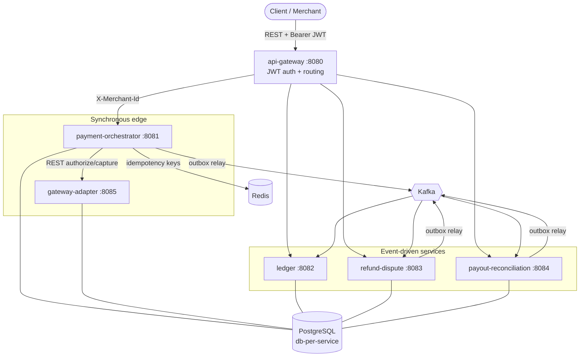
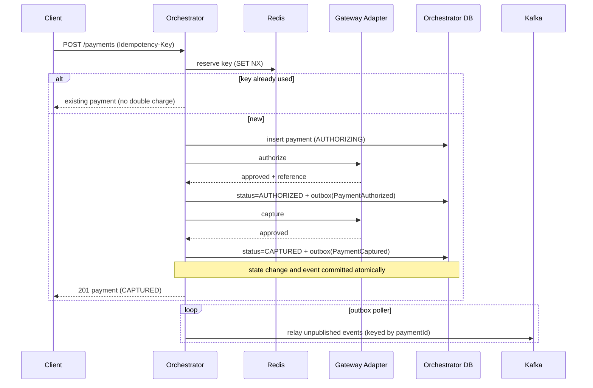

# PayFlow Architecture

## 1. Overview

PayFlow is a distributed, event-driven payment platform. It is decomposed into
independently deployable Spring Boot services that communicate through a
combination of **synchronous REST** (only where an immediate decision is
required) and **asynchronous Kafka events** (for everything that can be eventually
consistent).

The design optimizes for the two properties that matter most in payments:

- **Correctness** — money is never created, destroyed, or double-counted. This is
  enforced by idempotency at the edge, a transactional outbox for reliable
  publishing, idempotent consumers, and a double-entry ledger.
- **Resilience** — a broker hiccup or a downstream outage never loses a state
  change or an event. Services own their data and rebuild their own views from
  the event stream, so they are loosely coupled and independently recoverable.

## 2. Service topology



Why the split between synchronous and asynchronous:

- **Authorization and capture are synchronous** because the caller needs an
  immediate approve/decline. The orchestrator calls the gateway adapter over REST
  and returns the result in the same request.
- **Everything downstream of capture is asynchronous.** The ledger, refund and
  payout services react to events. They must never block the payment path, and
  they must survive being temporarily down.

## 3. The core payment saga



On any gateway failure the saga **compensates**: the payment moves to `FAILED`
and a `PaymentFailed` event is emitted so downstream systems can react (e.g.
notify the merchant, release inventory).

## 4. Reliability patterns

### 4.1 Idempotency (edge de-duplication)
The client supplies an `Idempotency-Key`. The orchestrator reserves it in Redis
(`SET key NX`, 24h TTL) and also persists it on the payment row with a unique
constraint. A retried request resolves to the original payment instead of
creating a second charge — the single most important safety property in payments.

### 4.2 Transactional outbox (no dual-write)
Writing to the database and publishing to Kafka are two systems; doing both
naively risks one succeeding and the other failing. Instead each service writes
the event into an `outbox_events` table **inside the same transaction** as the
state change. A background poller relays unpublished rows to Kafka and marks them
sent. State and events therefore can never diverge, even if Kafka is briefly
unavailable. (In production, Debezium CDC replaces the poller.)

### 4.3 Idempotent consumers (effectively-once)
Kafka delivery is at-least-once, so consumers may see an event twice. Every
consumer records processed `eventId`s in a `processed_events` table and skips
duplicates before applying any side effect. Events are keyed by aggregate id, so
per-payment ordering is preserved across partitions.

### 4.4 Dead-letter topics + retry
A consumer that keeps failing on one record must not block the partition behind
it. Each listener is wired with a `DefaultErrorHandler` that retries with a fixed
back-off (3 attempts, 2s apart) and then hands the record to a
`DeadLetterPublishingRecoverer`, which republishes it to `<topic>.DLT`. Poison
messages are quarantined for inspection while healthy traffic keeps flowing.

## 4a. The edge gateway and authentication

`api-gateway` (Spring Cloud Gateway, reactive) is the single front door. It:

1. Exposes a public `POST /auth/token` client-credentials endpoint that returns a
   short-lived **HS256 JWT** carrying the merchant id as its subject.
2. Authenticates every other request in a `GlobalFilter`: it verifies the Bearer
   token's signature and expiry, rejects invalid ones with `401`, and forwards the
   verified merchant id downstream as a trusted `X-Merchant-Id` header.
3. Routes by path to the owning service (`/api/v1/payments/**` → orchestrator,
   `/api/v1/ledger/**` → ledger, and so on).

Because the gateway terminates auth, the individual services stay free of
authentication code and simply trust the header on the internal network. In
production the signing key comes from a secrets manager and tokens from a real
identity provider; the interface does not change.

## 5. The double-entry ledger

Every money movement is recorded as a **balanced journal entry** — a set of
postings whose debits equal its credits. The ledger refuses to persist an
unbalanced entry, which makes a whole class of accounting bugs impossible.

Chart of accounts (simplified):

| Account | Normal side | Meaning |
|---|---|---|
| `PROVIDER_CLEARING` | debit (asset) | Funds due to us from the PSP |
| `MERCHANT_PAYABLE`  | credit (liability) | Funds we owe the merchant |
| `PLATFORM_REVENUE`  | credit (revenue) | Fees earned |
| `MERCHANT_RECEIVABLE` | debit (asset) | Funds due from the merchant |

Example postings:

```
Capture $49.99:
    DEBIT  PROVIDER_CLEARING:psp        49.99
    CREDIT MERCHANT_PAYABLE:merchant    49.99      (debits == credits ✓)

Refund $10.00:
    DEBIT  MERCHANT_PAYABLE:merchant    10.00
    CREDIT PROVIDER_CLEARING:psp        10.00
```

Account balances are stored as `sum(debits) - sum(credits)` and interpreted
against each account's normal side, so the whole system always nets to zero.

## 6. Refunds, disputes, payouts, reconciliation

- **Refunds** validate against the refund service's *own* projection of the
  captured payment (built from `payment.events`), call the gateway to refund, and
  emit `RefundCompleted` — which the ledger consumes to post the reversing entry.
- **Disputes** model the chargeback lifecycle
  (`OPEN → UNDER_REVIEW → EVIDENCE_SUBMITTED → WON/LOST`) and emit `DisputeOpened`.
- **Payouts** move a merchant's balance to their bank and emit `PayoutInitiated`.
- **Reconciliation** compares a provider settlement report against the platform's
  captured-payment projection and classifies every line as `MATCHED`,
  `AMOUNT_MISMATCH`, `MISSING_IN_LEDGER`, or `MISSING_IN_PROVIDER`. Nothing is
  allowed to silently disappear.

## 7. Data ownership

Each service owns its own PostgreSQL database (`payflow_orchestrator`,
`payflow_ledger`, `payflow_refund`, `payflow_payout`, `payflow_gateway`). No
service reads another's tables. Cross-service state travels only as events. This
is what allows the services to be deployed, scaled, and recovered independently.

## 8. Event catalogue

| Event | Topic | Producer | Consumers |
|---|---|---|---|
| `PaymentAuthorized` | `payment.events` | orchestrator | (audit) |
| `PaymentCaptured` | `payment.events` | orchestrator | ledger, refund, payout |
| `PaymentFailed` | `payment.events` | orchestrator | (notifications) |
| `RefundCompleted` | `refund.events` | refund | ledger |
| `DisputeOpened` | `dispute.events` | refund | (risk) |
| `PayoutInitiated` | `payout.events` | payout | (notifications) |

Events carry an `eventType` (and `eventId`) Kafka header so consumers dispatch on
the header rather than guessing the payload shape.

## 9. What a production build would add

Tokenization/vaulting for PCI scope reduction; a real PSP adapter behind the same
interface; CDC-based outbox publishing (Debezium) to replace the polling relay;
distributed tracing and correlation IDs end to end; rate limiting and fine-grained
authorization at the gateway; multi-currency FX and per-currency rounding; and
three-way reconciliation against bank statements. (An authenticating edge gateway,
dead-letter topics with retry/back-off, and a Testcontainers-based test suite are
already implemented in this repository.)
